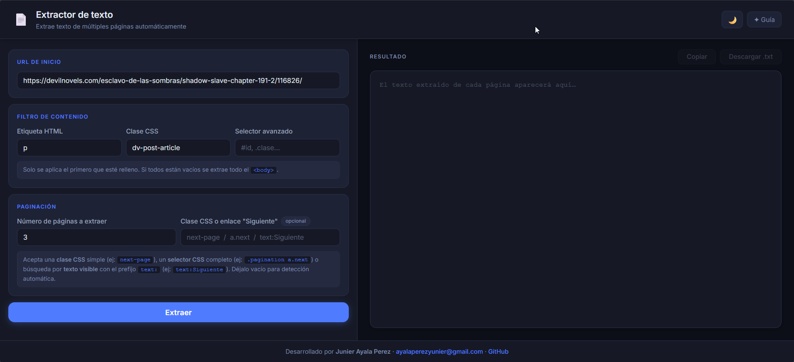

# 📄 Extractor de Texto por Páginas

Herramienta web para extraer el texto de novelas ligeras u otras páginas web de forma automática, capítulo a capítulo, sin necesidad de instalar nada.



---

## ✨ Características

- **Extracción multipágina** — extrae de 1 a 100 páginas consecutivas en una sola pasada.
- **Filtros de contenido** — aisla solo el texto del capítulo usando etiqueta HTML, clase CSS o selector CSS avanzado.
- **Paginación automática** — detecta el enlace "Siguiente" sin configuración extra.
- **Bypass de Cloudflare** — usa [Jina AI Reader](https://jina.ai/) como primera estrategia y una cadena de proxies CORS como respaldo.
- **Resultado en tiempo real** — el texto aparece en el área de resultado página a página mientras se extrae.
- **Copiar y descargar** — copia al portapapeles o descarga el resultado como `.txt`.
- **Modo claro / oscuro** — con persistencia en `localStorage`.
- **Guía interactiva** — tour paso a paso con [Driver.js](https://driverjs.com/) accesible desde el botón ✦ Guía.

---

## 🚀 Uso

1. Abre `index.html` en tu navegador (no requiere servidor).
2. Pega la URL del primer capítulo en el campo **URL de inicio**.
3. Configura el **Filtro de contenido** para aislar el texto:
   - **Etiqueta HTML** — ej: `p` (todos los párrafos)
   - **Clase CSS** — ej: `dv-post-article` (contenedor del capítulo)
   - **Selector avanzado** — ej: `#contenido > p`
     > Solo se aplica el primero que esté relleno. Si todos están vacíos se extrae todo el `<body>`.
4. Indica cuántas **páginas** quieres extraer.
5. (Opcional) Especifica el **selector del botón "Siguiente"** si la detección automática falla.
6. Pulsa **Extraer** y espera a que termine.
7. Usa **Copiar** o **Descargar .txt** para guardar el resultado.

---

## 🔍 Selector del enlace "Siguiente"

El campo acepta tres formatos:

| Formato               | Ejemplo              | Descripción                   |
| --------------------- | -------------------- | ----------------------------- |
| Clase CSS simple      | `next-page`          | Busca elementos con esa clase |
| Selector CSS completo | `.pagination a.next` | Selector CSS estándar         |
| Texto visible         | `text:Siguiente`     | Busca un enlace por su texto  |

Déjalo vacío para que la app lo detecte automáticamente.

---

## 🏗️ Estructura del proyecto

```
├── index.html       # Interfaz principal
├── script.js        # Lógica de extracción y proxies
├── GuiaDriver.js    # Tour interactivo (Driver.js)
└── styles.css       # Estilos (tema oscuro y claro)
```

---

## 🛠️ Tecnologías

| Tecnología                                                      | Uso                                     |
| --------------------------------------------------------------- | --------------------------------------- |
| HTML / CSS / JS vanilla                                         | Interfaz y lógica principal             |
| [Jina AI Reader](https://jina.ai/)                              | Extracción de texto, bypassa Cloudflare |
| Proxies CORS públicos                                           | Fallback para obtener HTML              |
| [Driver.js](https://driverjs.com/)                              | Guía interactiva                        |
| [Inter](https://fonts.google.com/specimen/Inter) (Google Fonts) | Tipografía                              |

---

## ⚠️ Limitaciones

- Algunos sitios con protección activa de Cloudflare o que requieren sesión iniciada pueden no ser accesibles.
- Los proxies CORS públicos son servicios de terceros y pueden tener límites de uso o caídas temporales.
- La detección automática de paginación puede fallar en sitios con navegación no estándar; en ese caso usa el campo **Selector del enlace "Siguiente"**.

---

## 👤 Autor

**Junier Ayala Perez**  
✉️ [ayalaperezyunier@gmail.com](mailto:ayalaperezyunier@gmail.com)  
🐙 [github.com/YunierAyala2000](https://github.com/YunierAyala2000)
